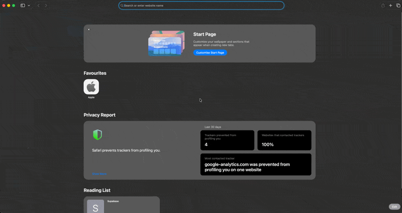

# Pokefan

A Pokemon collection app that runs entirely in the browser. It loads the first 200 Pokemon from [PokeAPI](https://pokeapi.co), lets you search them by name, favorite them with a tap on the heart, and organize them into groups you name yourself. Favorites and groups are saved in `localStorage`, so they survive reloads and browser restarts.

## Goal

Give Pokemon fans a fast way to find, favorite and group Pokemon without an account or a backend: a two-page app (Home for searching and collecting, Collection for browsing groups and favorites) where every change is persisted locally and shared between both pages in real time.

## Tech

- **React 19 + TypeScript** — function components with props typed by `interface`; contract types are derived from implementations (`ReturnType<typeof useStore>`) so refactors do not ripple into type files.
- **Vite** — instant dev server and production build; Vitest reuses the same config and path aliases, so there is one config to maintain.
- **React Router v7** (`react-router`, not `react-router-dom`) — client-side navigation between `/` and `/collection` without a page reload.
- **Tailwind CSS v4 + tailwind-variants** — utility styling with `tv()` for components that have several looks (Button colours, Badge type colours, Navigation active state), keeping every variant in one place instead of conditional class strings.
- **zod (`zod/mini`)** — validates the `localStorage` value on read, so invalid or hand-edited data falls back to an empty collection instead of crashing the page; the mini entry keeps the bundle small.
- **Vitest + Testing Library + user-event** — jsdom tests that assert rendered output and interaction, not class names; `vitest-fail-on-console` turns stray warnings into failures.
- **oxlint + Prettier** — fast linting and enforced formatting, both checked in CI on every pull request.
- **Inter (Google Fonts)** — loaded with one `@import` in `index.css` and set as Tailwind's `--font-sans`, so every component renders in Inter without class changes; `display=swap` keeps text visible in the system font for the brief moment before Inter has downloaded on a first visit.

## Getting Started

Requires **Node >= 22.17.1** (enforced by `engines` + `engine-strict`; `npm install` refuses older versions) and npm.

### Installation

#### Clone the repository

```bash
git clone https://github.com/krystaltao1/pokemon-fan.git
cd pokemon-fan
```

#### Install dependencies

Node >= 22.17.1 is required. If you do not have it, install it with [nvm](https://github.com/nvm-sh/nvm) (the repo ships an `.nvmrc`, so `nvm install` picks the right version):

```bash
curl -o- https://raw.githubusercontent.com/nvm-sh/nvm/v0.40.3/install.sh | bash
nvm install
nvm use
node -v            # v22.17.1 or newer
```

Then install the project dependencies:

```bash
npm install
```

#### Run the development server

```bash
npm run dev
```

Open http://localhost:5173.

### Unit test

```bash
npm run test           # run the whole suite once with coverage; fails below 100%
npm run test:watch     # re-run on file changes
```

Other checks that CI runs on every pull request:

```bash
npm run lint           # oxlint
npm run format:check   # prettier --check .
npm run build          # tsc -b && vite build
```

## Demo



## Trade-offs

Decisions made to fit the 2-hour limit, and where the current code stands.

- **Client-only app with `localStorage` as the database**
  - _Why_: the data is a few hundred ids that only change through the user's own clicks, so a server tier would add setup and failure modes without adding anything the user can do.
  - _Cost_: the collection lives in one browser only — switching devices or clearing site data loses it.
  - _Benefit_: zero infrastructure to run or maintain, and every change is saved instantly.

- **Fetch the first 200 Pokemon as list + one detail request each, with no cache**
  - _Why_: capping at 200 keeps the first load fast and predictable — fetching all 1,300+ Pokemon would delay first paint and hurt the experience for content most users rarely scroll to.
  - _Cost_: ~201 requests on load and no way to reach Pokemon beyond the first 200.
  - _Benefit_: fast first load, and search / pagination run locally with no further API calls.

- **Loading and error states at the page level, content renders only once data is ready**
  - _Why_: a loading or error state while fetching, and cards only once data has arrived, gives the user feedback at every step instead of a blank page.
  - _Fallback_: a failed request shows the raw error text in place of the page; there is no retry, the user reloads to recover.
  - _Cost_: every visit to a page refetches the list, and a failed request has no in-app recovery path.
  - _Benefit_: page components stay simple because they do not deal with loading or error states, and caching or retry can be added later without touching them.

- **Favorites and groups are two independent slices of one store**
  - _Why_: keeping the two independent avoids cross-slice rules and their edge cases, for example whether leaving the last group should also unfavorite, so each rule stays small, testable and easy to maintain.
  - _Cost_: no convenience shortcut — a Pokemon added to a group is not automatically a favorite, so the user manages the two lists separately.
  - _Benefit_: every business rule is a pure function with its own tests, and a new rule or slice can be added without touching the existing ones.

- **Dropdown and dialog close on an outside click, built in-house instead of importing a UI library**
  - _Why_: one small piece of reusable code covers the only overlay behaviour the app needs, closing on an outside click, without importing a library for a single feature.
  - _Cost_: it covers click-outside only, so extras a library would bundle, for example focus trapping, are added only when needed.
  - _Benefit_: the overlays feel natural to use, the same code serves both the dropdown and the dialog with its own tests, and the app stays small and consistent.

- **Automated checks guard every change: unit tests with a 100% coverage threshold, plus format, lint, typecheck and build in CI**
  - _Why_: every pull request is verified the same way before it can be merged, so code quality does not depend on anyone remembering to run the checks by hand.
  - _Cost_: no end-to-end tests, so full user flows across pages and reloads are still checked manually.
  - _Benefit_: regressions and untested code are caught before merge, and the suite runs in seconds so feedback stays fast.

- **Responsive grid via Tailwind breakpoints, no dedicated mobile pass**
  - _Why_: the card grid adapts from 2 to 3 to 5 columns with breakpoints alone, which covers laptop and desktop screen sizes without a separate layout.
  - _Cost_: phones are not specifically tuned or tested, and the dialog is capped at a small fixed max width.
  - _Benefit_: multiple screen sizes are matched with a few classes and there is only one layout to maintain.

## Future Improvements

- **Sync the collection to a backend** — improves data durability by keeping favorites and groups available across devices and safe from cleared browser data; today they live in one browser only.
- **Add user accounts** — enables per-user collections and gives the synced data an owner; this is the prerequisite for backend sync.
- **Filter and sort by type** — enhances search by narrowing the list to, for example, all Fire Pokemon instead of matching names only.
- **Rename groups** — improves group management by letting a group evolve without deleting it and re-adding every member.
- **Add a Pokemon detail view** — enriches each card with height, weight, moves and stats beyond image, name and types.
- **Build a mobile layout** — improves usability on phones for the card grid, group picker and dialogs.
- **Cache images and API responses** — speeds up repeat visits and keeps the app usable offline.
